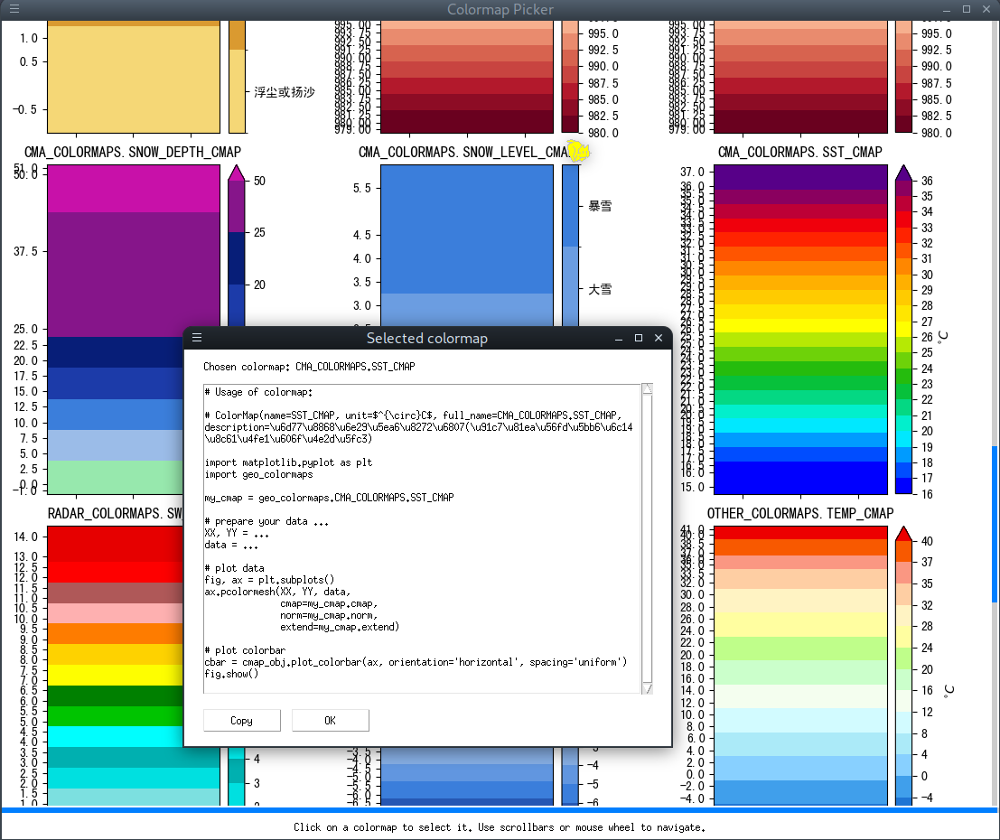

# 制作兼容 Python matplotlib库的气象、海洋绘图色标


## Dependencies

+ Python >= 3.5
+ numpy
+ matplotlib


## Install

```
pip install geo_colormaps
```


## 色标使用方法

### 使用色标绘图基本用法

例如， 使用默认的`CMA_COLORMAPS.TEMP_CMAP`绘图过程：

```python
import matplotlib.pyplot as plt

# 注意：须先 import geo_colormaps !!!
import geo_colormaps

# 选取一个色标
my_cmap = geo_colormaps.CMA_COLORMAPS.TEMP_CMAP

# 准备数据 ...
XX, YY = ...
data = ...

# 绘制
fig, ax = plt.subplots()
ax.pcolormesh(XX, YY, data,
              cmap=my_cmap.cmap,
              norm=my_cmap.norm,
              extend=my_cmap.extend)

# 绘制色标
cbar = cmap_obj.plot_colorbar(ax, orientation='horizontal', spacing='uniform')
fig.show()
```

其中：

+ `orientation`: 色标方向，`'vertical'` (default) or `'horizontal'`
+ `spacing`: 色标中色块尺寸分布，`'uniform'` (default) or `'proportional'`


一个更完整的示例代码可见 `examples/demo_sst_plot.py`


### 列出所有默认+用户自定义色标列表

```python
import geo_colormaps
geo_colormaps.list_cmaps(verbose=True)
```

示例输出：

```bash
These are default colormap groups:
Group name: CMA_COLORMAPS
   ALARM_LEVEL_CMAP    : ColorMap(name=ALARM_LEVEL_CMAP, unit=, full_name=CMA_COLORMAPS.ALARM_LEVEL_CMAP, description=预报（警报）等级分布图配色表
   DRAUGHT_LEVEL_CMAP  : ColorMap(name=DRAUGHT_LEVEL_CMAP, unit=, full_name=CMA_COLORMAPS.DRAUGHT_LEVEL_CMAP, description=气象干旱等级分布图配色表
   DTEMP_CMAP          : ColorMap(name=DTEMP_CMAP, unit=$^{\circ}C$, full_name=CMA_COLORMAPS.DTEMP_CMAP, description=变温分布图配色表
   FLOOD_LEVEL_CMAP    : ColorMap(name=FLOOD_LEVEL_CMAP, unit=, full_name=CMA_COLORMAPS.FLOOD_LEVEL_CMAP, description=洪涝等级分布图配色表
   FOG_CMAP            : ColorMap(name=FOG_CMAP, unit=, full_name=CMA_COLORMAPS.FOG_CMAP, description=雾区分布图配色表
   PRE_ANO_CMAP        : ColorMap(name=PRE_ANO_CMAP, unit=%, full_name=CMA_COLORMAPS.PRE_ANO_CMAP, description=降水量距平百分率分布图配色表
   PRE_LEVEL_CMAP      : ColorMap(name=PRE_LEVEL_CMAP, unit=, full_name=CMA_COLORMAPS.PRE_LEVEL_CMAP, description=降雨量等级分布图配色表
   PRE_TOTAL_CMAP      : ColorMap(name=PRE_TOTAL_CMAP, unit=mm, full_name=CMA_COLORMAPS.PRE_TOTAL_CMAP, description=累计降雨量分布图配色表
   RAIN_1H_CMAP        : ColorMap(name=RAIN_1H_CMAP, unit=mm, full_name=CMA_COLORMAPS.RAIN_1H_CMAP, description=1h累积降水量实况色标(采自国家气象信息中心)
   RAIN_3H_CMAP        : ColorMap(name=RAIN_3H_CMAP, unit=mm, full_name=CMA_COLORMAPS.RAIN_3H_CMAP, description=3h累积降水量实况色标(采自国家气象信息中心)
   RH850_CMAP          : ColorMap(name=RH850_CMAP, unit=%, full_name=CMA_COLORMAPS.RH850_CMAP, description=850hPa相对湿度色标(台风湿度诊断 采自国家气象信息中心)
   RH_CMAP             : ColorMap(name=RH_CMAP, unit=%, full_name=CMA_COLORMAPS.RH_CMAP, description=相对湿度分布图配色表
   SANDSTORM_LEVEL_CMAP: ColorMap(name=SANDSTORM_LEVEL_CMAP, unit=, full_name=CMA_COLORMAPS.SANDSTORM_LEVEL_CMAP, description=沙尘天气等级分布图配色表
   SLP_CMAP            : ColorMap(name=SLP_CMAP, unit=hPa, full_name=CMA_COLORMAPS.SLP_CMAP, description=海平面气压色标(台风动力诊断 采自国家气象信息中心)
   SLP_REVERSED_CMAP   : ColorMap(name=SLP_REVERSED_CMAP, unit=hPa, full_name=CMA_COLORMAPS.SLP_REVERSED_CMAP, description=海平面气压色标(台风动力诊断 采自国家气象信息中心)
   SNOW_DEPTH_CMAP     : ColorMap(name=SNOW_DEPTH_CMAP, unit=cm, full_name=CMA_COLORMAPS.SNOW_DEPTH_CMAP, description=积雪分布图配色表
   SNOW_LEVEL_CMAP     : ColorMap(name=SNOW_LEVEL_CMAP, unit=, full_name=CMA_COLORMAPS.SNOW_LEVEL_CMAP, description=降雪量等级分布图配色表
   SST_CMAP            : ColorMap(name=SST_CMAP, unit=$^{\circ}C$, full_name=CMA_COLORMAPS.SST_CMAP, description=海表温度色标(采自国家气象信息中心)
   TEMP_ANO_CMAP       : ColorMap(name=TEMP_ANO_CMAP, unit=$^{\circ}C$, full_name=CMA_COLORMAPS.TEMP_ANO_CMAP, description=气温距平分布图配色表
   TEMP_CMAP           : ColorMap(name=TEMP_CMAP, unit=$^{\circ}C$, full_name=CMA_COLORMAPS.TEMP_CMAP, description=气温分布图配色表
   TEMP_RT_CMAP        : ColorMap(name=TEMP_RT_CMAP, unit=$^{\circ}C$, full_name=CMA_COLORMAPS.TEMP_RT_CMAP, description=气温实况色标(采自国家气象信息中心)
   VIS_CMAP            : ColorMap(name=VIS_CMAP, unit=km, full_name=CMA_COLORMAPS.VIS_CMAP, description=最低能见度色标(采自国家气象信息中心)
   WIND_LEVEL_CMAP     : ColorMap(name=WIND_LEVEL_CMAP, unit=, full_name=CMA_COLORMAPS.WIND_LEVEL_CMAP, description=风力等级（6级以上）分布图配色表
   WS10_CMAP           : ColorMap(name=WS10_CMAP, unit=m/s, full_name=CMA_COLORMAPS.WS10_CMAP, description=10m风速色标(6.25km 1h 采自国家气象信息中心)
   WS10_TYPHOON_CMAP   : ColorMap(name=WS10_TYPHOON_CMAP, unit=m/s, full_name=CMA_COLORMAPS.WS10_TYPHOON_CMAP, description=10m风速色标(台风动力诊断 采自国家气象信息中心)
Group name: RADAR_COLORMAPS
   CR_CMAP             : ColorMap(name=CR_CMAP, unit=dBZ, full_name=RADAR_COLORMAPS.CR_CMAP, description=组合反射率色标
   ET_CMAP             : ColorMap(name=ET_CMAP, unit=km, full_name=RADAR_COLORMAPS.ET_CMAP, description=回波顶高色标
   PRE_TOTAL_CMAP      : ColorMap(name=PRE_TOTAL_CMAP, unit=mm, full_name=RADAR_COLORMAPS.PRE_TOTAL_CMAP, description=降水累积量色标
   REFL_CMAP           : ColorMap(name=REFL_CMAP, unit=dBZ, full_name=RADAR_COLORMAPS.REFL_CMAP, description=反射率色标
   SW_CMAP             : ColorMap(name=SW_CMAP, unit=m/s, full_name=RADAR_COLORMAPS.SW_CMAP, description=谱宽色标
   VIL_CMAP            : ColorMap(name=VIL_CMAP, unit=$kg/m^2$, full_name=RADAR_COLORMAPS.VIL_CMAP, description=液态含水量色标
   V_CMAP              : ColorMap(name=V_CMAP, unit=m/s, full_name=RADAR_COLORMAPS.V_CMAP, description=多普勒速度色标
Group name: OTHER_COLORMAPS
   RAIN_12H_CMAP       : ColorMap(name=RAIN_12H_CMAP, unit=mm, full_name=OTHER_COLORMAPS.RAIN_12H_CMAP, description=12h降水量色标
   RAIN_1H_CMAP        : ColorMap(name=RAIN_1H_CMAP, unit=mm, full_name=OTHER_COLORMAPS.RAIN_1H_CMAP, description=1h降水量色标
   RAIN_24H_CMAP       : ColorMap(name=RAIN_24H_CMAP, unit=mm, full_name=OTHER_COLORMAPS.RAIN_24H_CMAP, description=24降水量色标
   RAIN_3H_CMAP        : ColorMap(name=RAIN_3H_CMAP, unit=mm, full_name=OTHER_COLORMAPS.RAIN_3H_CMAP, description=3h降水量色标
   RAIN_6H_CMAP        : ColorMap(name=RAIN_6H_CMAP, unit=mm, full_name=OTHER_COLORMAPS.RAIN_6H_CMAP, description=6h降水量色标
   RH_CMAP             : ColorMap(name=RH_CMAP, unit=%, full_name=OTHER_COLORMAPS.RH_CMAP, description=相对湿度色标
   TEMP_CMAP           : ColorMap(name=TEMP_CMAP, unit=$^{\circ}C$, full_name=OTHER_COLORMAPS.TEMP_CMAP, description=温度色标
You haven't added any custom colormaps.
```


### 绘制所有默认+用户自定义色标示例图


```python
import geo_colormaps
geo_colormaps.plot_cmaps()
```

图片会保存在:
+ Linux 或 MacOS 系统下： `~/.config/geo_colormaps/images/all_cmaps_demo.png`。
+ Windows 系统下：`%appdata%\geo_colormaps\images\all_cmaps_demo.png`

图片缩略图：


### 定义匿名色标

如果仅需要自定义色标的各阶梯数值，不想自己定义阶梯的颜色时，可使用`matplotlib`自带的配色表,
配合自定义的数值阶梯完成匿名色标定义。

例如：

```python
import geo_colormaps

custom_levels = [None] + list(np.arange(10, 32, 2)) + [None]   # 两端的 None 代表向下、向上溢出三角箭头
custom_unit   = r'$^{\circ}C$'                                 # 摄氏度的LaTeX写法
mpl_cmp       =  'rainbow'                                     # matplotlib自带的一款配色名称

cmap_obj   = geo_colormaps.colormap.create_cmap_from_levels(custom_levels,
                                                            custom_unit,
                                                            mpl_cmp)

# 使用创建的色标绘图：
XX, YY = ...
data = ...

fig, ax = plt.subplots()
ax.contourf(XX, YY, data,
            cmap=cmap_obj.cmap,
            norm=cmap_obj.norm,
            extend=cmap_obj.extend)

# 绘制色标
cmap_obj.plot_colorbar(ax=ax)
fig.show()
```

若想定义离散/分类型的色标，仅需将`custom_levels`定义写成以下形式：

```
custom_levels = [(discrete_level, level_label), (discrete_level, level_label), ...]
```

例如：

```python

custom_levels = [(10, 'Ten'), (20, 'Twenty')]
# can also omit the level label, then the discrete level it self will be used as label:
#custom_levels = [(10, ), (20, )]
custom_unit   = r'$^{\circ}C$'
mpl_cmp       = 'rainbow'
cmap_obj      = geo_colormaps.colormap.create_cmap_from_levels(custom_levels,
                                                            custom_unit,
                                                            mpl_cmp)
```

也可省略`level_label`, 此时类别标签将自动使用`discrete_level`。


使用`create_cmap_from_levels()`定义色标的绘图示例图：


相关示例代码见 `examples/demo_custom_colormap_from_levels.py`


### 图形界面色标选取器

执行：

```python
import geo_colormaps
geo_colormaps.colormap_picker()
```

将开启一个色标选取界面，包含所有默认+自定义色标示例图，及对应的色标名称，如`CMA_COLORMAPS.TEMP_CMAP`。

可浏览色标图，点击选取一款适合的色标。此时会弹出一个对话框，给出一段实例代码。见下效果图：





此时点击`Copy`按钮可将示例代码拷贝到剪贴板。


**注意**: 使用`create_cmap_from_levels()`方法定义的匿名色标将不会出现在色标选取器中。


## 包含的默认色标

### 中国气象局《气象预报服务产品色标标准》色标实现

#### 参考文件

《中国气象局气象预报服务产品色标标准》（征求意见稿, 2009-11-23）。


#### 包含色标


| 色标描述                                              | 变量名                                 | 定义文件位置                                      | 示例图位置               |
| ---------------------------------                     | -------------------------------------- | -------------------------------------             | ------------------------ |
| 预报（警报）等级分布图配色表                          | `CMA_COLORMAPS.ALARM_LEVEL_CMAP`       | `colormap_defs/cma_colormaps/alarm_level.csv`     | `images/cma_colormaps/`  |
| 气象干旱等级分布图配色表                              | `CMA_COLORMAPS.DRAUGHT_LEVEL_CMAP`     | `colormap_defs/cma_colormaps/draught_level.csv`   | ~                        |
| 变温分布图配色表                                      | `CMA_COLORMAPS.DTEMP_CMAP`             | `colormap_defs/cma_colormaps/dtemp.csv`           | ~                        |
| 洪涝等级分布图配色表                                  | `CMA_COLORMAPS.FLOOD_LEVEL_CMAP`       | `colormap_defs/cma_colormaps/flood_level.csv`     | ~                        |
| 雾区分布图配色表                                      | `CMA_COLORMAPS.FOG_CMAP`               | `colormap_defs/cma_colormaps/fog.csv`             | ~                        |
| 降水量距平百分率分布图配色表                          | `CMA_COLORMAPS.PRE_ANO_CMAP`           | `colormap_defs/cma_colormaps/pre_ano.csv`         | ~                        |
| 降雨量等级分布图配色表                                | `CMA_COLORMAPS.PRE_LEVEL_CMAP`         | `colormap_defs/cma_colormaps/pre_level.csv`       | ~                        |
| 累计降雨量分布图配色表                                | `CMA_COLORMAPS.PRE_TOTAL_CMAP`         | `colormap_defs/cma_colormaps/pre_total.csv`       | ~                        |
| 相对湿度分布图配色表                                  | `CMA_COLORMAPS.RH_CMAP`                | `colormap_defs/cma_colormaps/rh.csv`              | ~                        |
| 沙尘天气等级分布图配色表                              | `CMA_COLORMAPS.SANDSTORM_LEVEL_CMAP`   | `colormap_defs/cma_colormaps/sandstorm_level.csv` | ~                        |
| 积雪分布图配色表                                      | `CMA_COLORMAPS.SNOW_DEPTH_CMAP`        | `colormap_defs/cma_colormaps/snow_depth.csv`      | ~                        |
| 降雪量等级分布图配色表                                | `CMA_COLORMAPS.SNOW_LEVEL_CMAP`        | `colormap_defs/cma_colormaps/snow_level.csv`      | ~                        |
| 气温距平分布图配色表                                  | `CMA_COLORMAPS.TEMP_ANO_CMAP`          | `colormap_defs/cma_colormaps/temp_ano.csv`        | ~                        |
| 气温分布图配色表                                      | `CMA_COLORMAPS.TEMP_CMAP`              | `colormap_defs/cma_colormaps/temp.csv`            | ~                        |
| 风力等级（6级以上）分布图配色表                       | `CMA_COLORMAPS.WIND_LEVEL_CMAP`        | `colormap_defs/cma_colormaps/wind_level.csv`      | ~                        |
| 1h累积降水量实况色标(采自国家气象信息中心)            | `CMA_COLORMAPS.RAIN_1H_CMAP`           | `colormap_defs/cma_colormaps/rain_1h.csv`         | ~                        |
| 3h累积降水量实况色标(采自国家气象信息中心)            | `CMA_COLORMAPS.RAIN_3H_CMAP`           | `colormap_defs/cma_colormaps/rain_3h.csv`         | ~                        |
| 气温实况色标(采自国家气象信息中心)                    | `CMA_COLORMAPS.TEMP_RT_CMAP`           | `colormap_defs/cma_colormaps/temp_rt.csv`         | ~                        |
| 10m风速色标(6.25km 1h 采自国家气象信息中心)           | `CMA_COLORMAPS.WS10_CMAP`              | `colormap_defs/cma_colormaps/ws10.csv`            | ~                        |
| 海平面气压色标(台风动力诊断 采自国家气象信息中心)     | `CMA_COLORMAPS.SLP_CMAP`               | `colormap_defs/cma_colormaps/slp.csv`             | ~                        |
| 10m风速色标(台风动力诊断 采自国家气象信息中心)        | `CMA_COLORMAPS.WS_TYPHOON_CMAP`        | `colormap_defs/cma_colormaps/ws10_typhoon.csv`    | ~                        |
| 850hPa相对湿度色标(台风湿度诊断 采自国家气象信息中心) | `CMA_COLORMAPS.RH850_CMAP`             | `colormap_defs/cma_colormaps/rh850.csv`           | ~                        |
| 海表温度色标(采自国家气象信息中心)                    | `CMA_COLORMAPS.SST_CMAP`               | `colormap_defs/cma_colormaps/sst.csv`             | ~                        |
| 最低能见度色标(采自国家气象信息中心)                  | `CMA_COLORMAPS.VIS_CMAP`               | `colormap_defs/cma_colormaps/vis.csv`             | ~                        |


#### 色标样例


### 《多普勒天气雷达观测产品色标规范》色标实现

#### 参考文件

  《多普勒天气雷达观测产品色标规范》


#### 包含色标


| 色标描述         | 变量名                           | 定义文件位置                                  | 示例图位置                |
| ---------------- | ------------------------------   | ----------------------------                  | ------------------------  |
| 反射率色标       | `RADAR_COLORMAPS.REFL_CMAP`      | `colormap_defs/radar_colormaps/refl.csv`      | `images/radar_colormaps/` |
| 组合反射率色标   | `RADAR_COLORMAPS.CR_CMAP`        | `colormap_defs/radar_colormaps/cr.csv`        | ~                         |
| 多普勒速度色标   | `RADAR_COLORMAPS.V_CMAP`         | `colormap_defs/radar_colormaps/v.csv`         | ~                         |
| 回波顶高色标     | `RADAR_COLORMAPS.ET_CMAP`        | `colormap_defs/radar_colormaps/et.csv`        | ~                         |
| 液态含水量色标   | `RADAR_COLORMAPS.VIL_CMAP`       | `colormap_defs/radar_colormaps/vil.csv`       | ~                         |
| 降水累积量色标   | `RADAR_COLORMAPS.PRE_TOTAL_CMAP` | `colormap_defs/radar_colormaps/pre_total.csv` | ~                         |
| 谱宽色标         | `RADAR_COLORMAPS.SW_CMAP`        | `colormap_defs/radar_colormaps/sw.csv`        | ~                         |


#### 色标样例


### 其它色标


#### 包含色标


| 色标描述         | 变量名                         | 定义文件位置                                | 示例图位置                |
| ---------------- | ------------------------------ | ----------------------------                | ------------------------  |
| 1h降水量色标     | `OTHER_COLORMAPS.RAIN_1H_CMAP` | `colormap_defs/other_colormaps/rain_1h.csv` | `images/other_colormaps/` |


#### 色标样例


## 完整色标列表

默认色标列表见 [colormap_list.md](geo_colormaps/colormap_list.md).

默认色标+用户自定义色标列表，见

+ Linux 或 MacOS 系统下： `~/.config/geo_colormaps/colormap_list.md`
+ Windows 系统下：`%appdata%\geo_colormaps\colormap_list.md`


## 添加自定义色标


新色标建议在**用户默认配置目录**下新建一个文件夹，例如

+ Linux 或 MacOS 系统下： `~/.config/geo_colormaps/my_colormaps`。
+ Windows 系统下：`%appdata%\geo_colormaps\my_colormaps`

注意： `~/.config/geo_colormaps` (或 `%appdata%\geo_colormaps`) 是本软件包指定的用户自定义色标存放位置，须严格匹配。
`my_colormaps`是用户为自定义色标系列起的名称，可自选名称（不要带空格或其他非法字符即可）。

之后，在 `my_colormaps` 内以`csv`文件格式新增色标。如新建`my_colormaps/pre_total.csv` , 其中：


```
description=累计降雨量分布图配色表
unit=mm
vmin , vmax , r   , g   , b   , label
0.1  , 9.9  , 165 , 243 , 141 ,
10   , 24.9 , 153 , 210 , 202 ,
25   , 49.9 , 155 , 188 , 232 ,
50   , 99.9 , 107 , 157 , 225 ,
100  , 200  , 59  , 126 , 219 ,
200  , 250  , 43  , 92  , 194 ,
250  , 300  , 28  , 59  , 169 ,
300  , 400  , 17  , 44  , 144 ,
400  , 600  , 7   , 30  , 120 ,
600  , 800  , 70  , 25  , 129 ,
800  , 1000 , 134 , 21  , 138 ,
1000 , 2000 , 200 , 17  , 169 ,
2000 , None , 129 , 0   , 64  ,
```

定义后的新色标使用方法：


```python
# 注意：须先 import geo_colormaps !!!
import geo_colormaps
print(geo_colormaps.MY_COLORMAPS.PRE_TOTAL_CMAP)
```

更多csv示例见 `colormap_defs/cma_colormaps`, `colormap_defs/radar_colormaps`。


## Changelog

### v0.2.0

+ 添加匿名色标定义方法：`geo_colormaps.colormaps.create_cmap_from_levels()`
+ 添加更多默认色标
+ 添加已有色标列表打印方法：`geo_colormaps.list_cmaps()`
+ 添加已有色标列表绘图方法：`geo_colormaps.plot_cmaps()`
+ 添加GUI色标选取器：`geo_colormaps.gui_picker()`
+ 移除`jinja2`依赖
